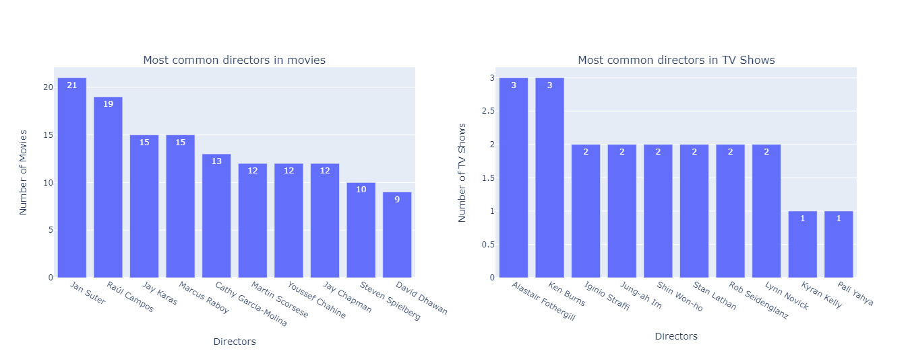

# Netflix Shows Exploratory Data Analysis

In this notebook, I will examine the dataset consisting of Movies and TV Shows on Netflix. Afterwards, I will visualize the data that I have obtained from these reviews and that I consider important. I wrote some questions to demonstrate this in a simpler way. In my study, I will try to answer the questions I wrote below with the analyzes I have made. Finally, I think I should point out that I separated Movies and TV Shows while doing my analysis. I thought this method would be more useful and meaningful since they are two different branches.

* What is the distribution of Movies and TV Shows on Netflix ?
* Who are the most popular directors in Movies and TV Shows on Netflix ?
* Who are the most popular actors in Movies and TV Shows on Netflix ?
* Which countries have the most Movies and TV Shows on netflix ?
* What is the most popular genre in the countries with the most Movies and TV Shows on Netflix ?
* What is the average duration in countries with the most Movies and TV Shows on Netflix ?
* What is the date distribution of movies and TV shows on Netflix ?
* What is the most popular genre in Movies and TV Shows on Netflix ?
* What is the rating percentage of Movies and TV Shows on Netflix ?
* What is the duration distribution of Movies and TV Shows on Netflix ?

## Data

To briefly talk about the dataset, the dataset consists of Movies and TV Shows available on Netflix. The dataset contains a lot of data on Movies and TV Shows. The description of these data is as follows.

* show_id      : Unique ID for every Movie / Tv Show
* type         : Identifier - A Movie or TV Show
* title        : Title of the Movie / Tv Show
* director     : Director of the Movie
* cast         : Actors involved in the movie / show
* country      : Country where the movie / show was produced
* date_added   : Date it was added on Netflix
* release_year : Actual Release year of the move / show
* rating       : TV Rating of the movie / show
* duration     : Total Duration - in minutes or number of seasons
* listed_in    : Genre
* description  : The summary description

<a href = 'https://www.kaggle.com/shivamb/netflix-shows'>You can access the dataset here</a>

## Exploratory Data Analysis
I made the analysis of Netflix shows using many features such as director, cast, country, date, rating, duration, genre. You can see some of them below.

It doesn't make much sense to review the notebook on github because the images are not visible. <a href = 'https://nbviewer.jupyter.org/github/berk77/Netflix_Shows_EDA/blob/main/netflix-shows-eda.ipynb'>If you wish, you can access the notebook here.</a>
